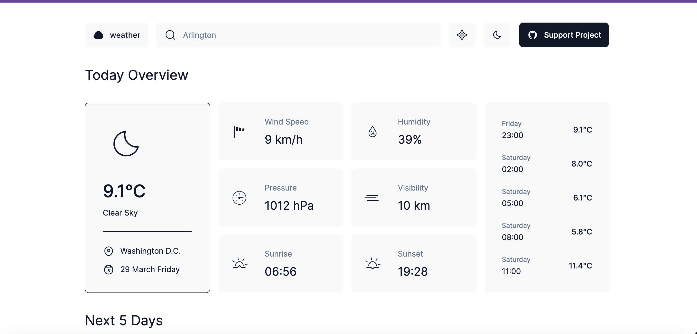

# Weather Dashboard

## Overview

The Weather Dashboard is a simple yet powerful web application designed to provide real-time weather information for any location by utilizing latitude and longitude coordinates. It fetches data directly from the OpenWeatherMap API and displays it in an easy-to-understand format. This project showcases the use of JavaScript, Node.js with Express, and EJS templates to deliver a responsive and intuitive user interface. All client-side assets, including stylesheets, images, and JavaScript files, are hosted locally to ensure fast loading times and a seamless user experience.

## Features

- **Real-time Weather Data**: Displays temperature, weather conditions, humidity, wind speed, and more for a given location.
- **Client-side Assets**: Utilizes Bootstrap for styling, with all assets served locally from the repository.
- **Vanilla JavaScript**: For dynamic content and interactivity without the need for heavy JavaScript frameworks.
- **Responsive Design**: Ensures a great user experience on both desktop and mobile devices.

## Technology Stack

- **JavaScript**: The scripting language used for the application's functionality.
- **Node.js with Express**: For the backend server, handling API requests to OpenWeatherMap.
- **EJS Templates**: For dynamically generating HTML pages on the server-side.
- **Bootstrap**: For styling and responsive design. Tailwind CSS can be substituted if preferred.
- **Jest**: Utilized for writing and running tests to ensure code reliability.

## Getting Started

To run this project locally, follow these steps:

1. Clone the repository from GitHub:
2. Navigate to the project directory:
3. Install the required npm packages:

## Installation

Clone the repository and install dependencies using npm:

`npm install`

## Usage

Start the development server:

`npm run dev`

This will open the app in your default browser.

Build the app for production:

`npm run build`

Preview the production build:

`npm run preview`

## Contribution

Feel free to fork the repository and submit pull requests. For major changes, please open an issue first to discuss what you would like to change.

## Author

- Nishant Parihar https://github.com/nash2393/Weather-App-FullStack

## License

This project is open source and available under the [MIT License](LICENSE).

## License

This project is licensed under the MIT License.
